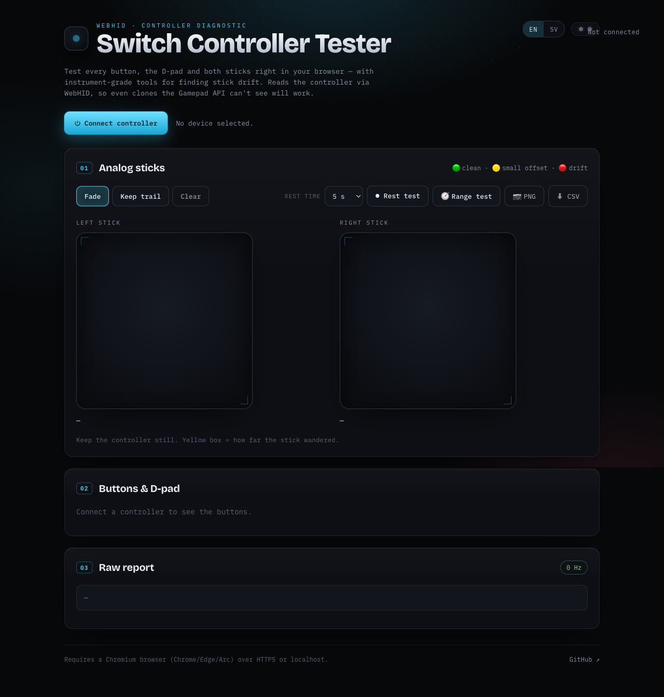

# 🎮 Switch Controller Tester

[](https://speakman.github.io/switch-controller-tester/)
[](https://github.com/speakman/switch-controller-tester/stargazers)
[](LICENSE)
[](https://developer.mozilla.org/docs/Web/API/WebHID_API)

A browser-based tester for **Nintendo Switch controllers** (Pro Controller and
licensed clones like the **PowerA Enhanced Wireless**), with extensive tools for
finding **analog stick drift** — no install, runs entirely client-side via
**WebHID**.

**▶ Live: https://speakman.github.io/switch-controller-tester/**



## Why WebHID (and not the Gamepad API)

Licensed Switch Pro clones report a **Vendor/Product ID of `0`** over Bluetooth.
The browser **Gamepad API** never lists them, and macOS's GameController
framework can miss them too. **WebHID** lets you pick the device manually in a
permission prompt and read its raw HID reports directly — so it works where the
usual gamepad testers come up empty. The app parses the controller's HID report
descriptor generically (buttons, hat/D-pad, analog axes), so it adapts to
whatever the device exposes.

## Features

- **Every input, live:** all buttons light up, D-pad, and both analog sticks.
- **Button identify:** press a button to see its raw index, mapped against the
  standard Switch layout — handy when a clone's button order differs.
- **Stick drift tools:**
  - Live dual-stick visualizer with a wander **trail** (fade or persist), a
    **bounding box**, and **peak-hold** of the largest offset seen.
  - **Rest test** (5 / 15 / 30 s): per-axis offset, jitter, and a 🟢/🟡/🔴
    verdict for each stick.
  - **Range test:** rotate the sticks fully to map reach per direction, draw the
    achieved perimeter, and flag weak sectors — catches range loss / dead spots,
    not just center drift.
  - **Export** a PNG snapshot (proof for warranty claims) or the raw samples as
    CSV.
- **Raw report viewer:** report ID, byte length, live hex, and report rate (Hz).
- **Multilingual:** English by default, Swedish selectable; auto-detects your
  browser language and remembers your choice.

## Requirements

- A **Chromium desktop** browser — Chrome, Edge, Opera, Brave or Arc. Safari,
  Firefox and **mobile browsers don't support WebHID**, so the test is
  desktop-only (the page detects this and shows guidance instead).
- A **secure context**: the live GitHub Pages URL (HTTPS) or `http://localhost`.

## Using it

1. Open the live URL (or serve locally — see below) in Chrome.
2. Click **Connect controller** and pick your controller in the prompt.
3. Press buttons / move sticks — everything updates live.
4. For a drift check: put the controller down untouched and click **Rest test**,
   or switch to **Keep trail** and watch the wander build up. The UI defaults to
   English; use the EN/SV switch in the header for Swedish.

## Run locally

WebHID needs a secure context, so open it over `localhost` (not `file://`):

```sh
python3 -m http.server 8787
# then open http://localhost:8787
```

## How it's built

Plain HTML/CSS/ES modules, no framework, no build step.

| File | Responsibility |
|------|----------------|
| `js/hid.js` | WebHID connection + generic HID report-descriptor parsing |
| `js/sticks.js` | Canvas stick visualizer + drift recorder/stats |
| `js/buttons.js` | Live button / D-pad panel + identify |
| `js/app.js` | Orchestration, render loop, export |
| `js/i18n.js` | Tiny i18n: en/sv dictionaries, auto-detect, switcher |

## Tests

The correctness-critical decode logic is pure (no DOM/WebHID) and unit-tested
with Node's built-in assert — no dependencies, no build step:

```sh
node tests/run.mjs
```

Covers HID bit extraction, signed-axis sign-extension + normalization, D-pad
direction decoding, and the drift-verdict thresholds.

## Notes & limits

- Motion/gyro and rumble use Nintendo's vendor protocol and aren't covered;
  the PowerA Enhanced Wireless has no motion sensor anyway.
- Button labels assume the standard Switch order; use **identify** to confirm
  your specific unit.

## ⭐ Star it

If this saved you a warranty headache — or you just think it's neat — consider
giving the repo a [star](https://github.com/speakman/switch-controller-tester).
It genuinely helps others find it.

## License

[MIT](LICENSE).
